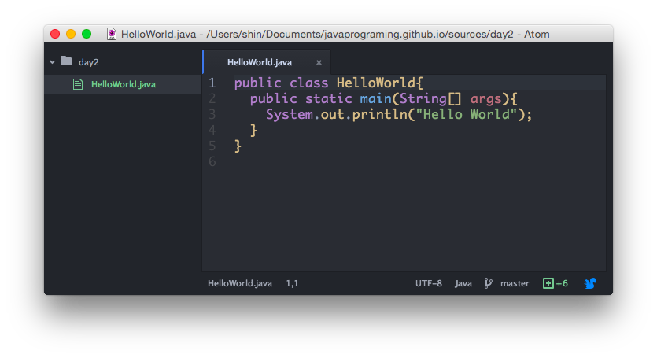
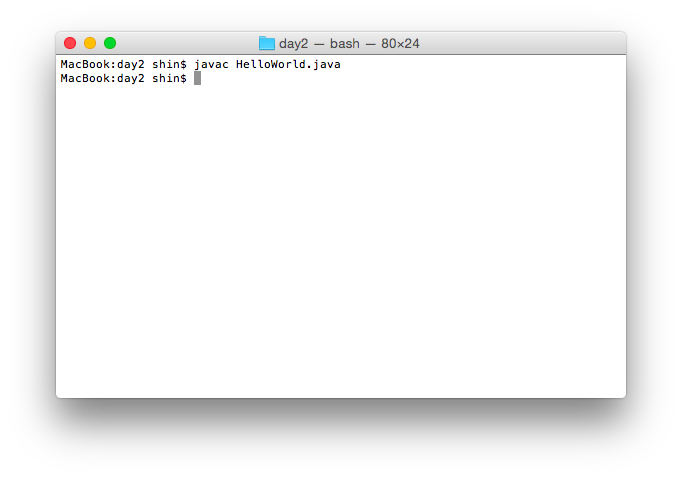
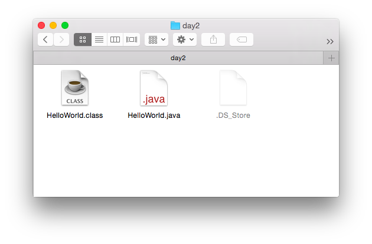
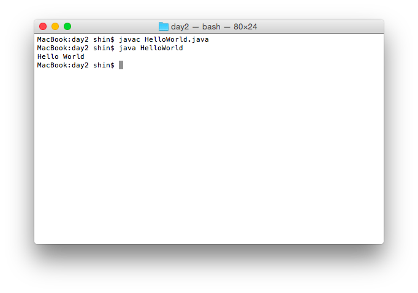

[TOP](./index.html)


## Hello World
1. Create Java file  
 * Open text editor. ( I am using [atom editor](https://atom.io/) )
 * File name is ```HelloWorld.java``` .
 
 * Save to "User directory"/java/day2/HelloJava.java
 * File content is
```java
public class HelloWorld{
  public static void main(String[] args){
    System.out.println("Hello World");
  }
}
```

1. Compile Java file
 * Open Terminal
 * Change Directory to "User directory"/java/day2/
 * Run ```javac HelloJava.java```  

 * HelloWorld.class file is created.
 


1. Run Java Application
 * Run ```java HelloJava```  .  
 "Hello World" is displayed.

