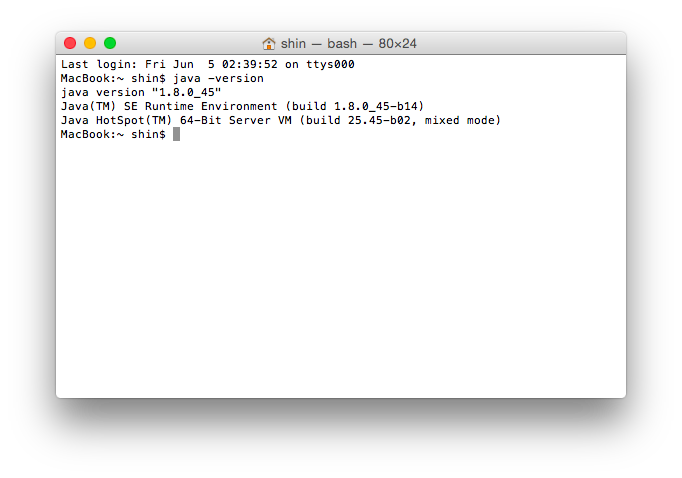

# Welcome to Java Programing


## Development environment
1. Install JDK.
http://www.oracle.com/technetwork/java/javase/downloads/jdk8-downloads-2133151.html


2. Confirming Java installation.
 1. Open Terminal
 1. Run ```java -version```

